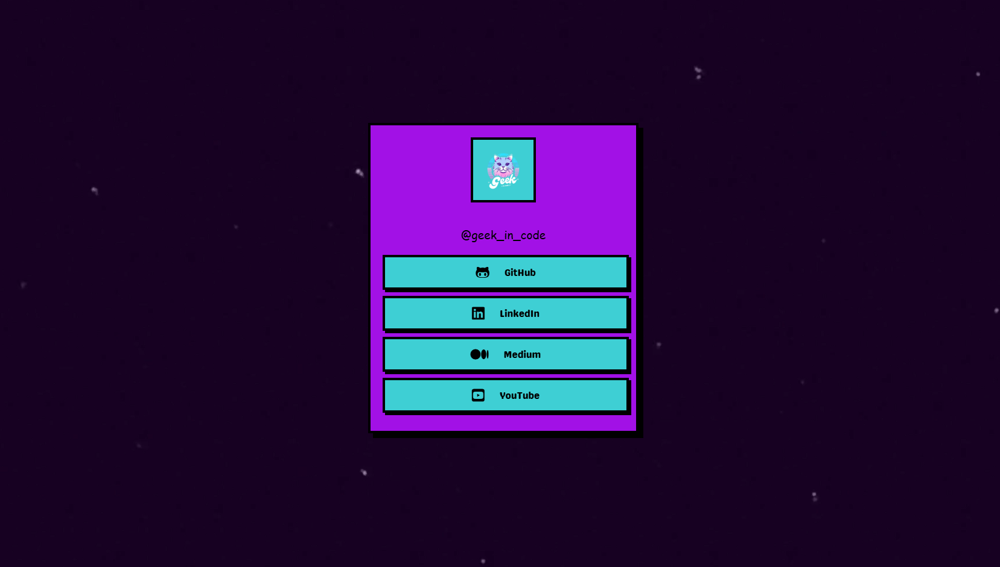
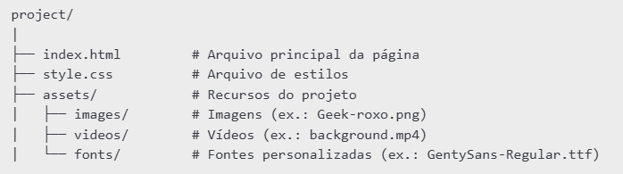

# Geek in Code 


## Descrição

#### Este projeto é uma página web personalizada para o perfil @geek_in_code, apresentando um design inspirado em jogos retrô dos anos 80, com fontes estilizadas, ícones de redes sociais e um vídeo de fundo. O objetivo é criar um layout visualmente atrativo que represente a identidade do perfil.

## Funcionalidades

- Vídeo de fundo: Um vídeo reproduzido em loop, sem som, cobre toda a tela como plano de fundo.
- Links para redes sociais: Botões estilizados com ícones e texto direcionam para GitHub, LinkedIn, Medium e YouTube.
- Design retrô: Elementos com bordas destacadas, sombras simulando pixel art e cores vibrantes.
- Responsividade: Compatível com telas de dispositivos móveis e desktops.

## Tecnologias Utilizadas

- HTML5: Para estruturação do conteúdo.
- CSS3: Para estilização do layout, responsividade e animações.
- Fontes personalizadas: Uso de arquivos TTF (Capriola, Genty, Genty Sans e More Sugar).
- Font Awesome: Para os ícones das redes sociais.

## Estrutura de Pastas



## Como Utilizar

1. Clone o repositório:

```sh
git clone git@github.com:Ana-Alice-Honorio/linktree-insta.git
```

2. Estrutura dos arquivos:
   
Certifique-se de que os arquivos estejam na estrutura correta (veja a seção Estrutura de Pastas).

3. Abra o projeto no navegador:
   
Abra o arquivo index.html em qualquer navegador.

4. Edite as informações:
   
Atualize os links das redes sociais no arquivo index.html.

Substitua o vídeo de fundo (em assets/videos/background.mp4) caso deseje.

## Autor

Desenvolvido por @geek_in_code.